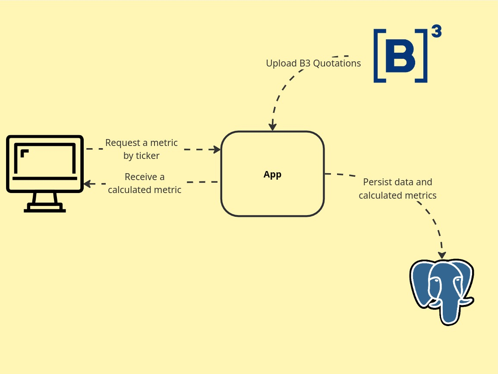

<p align="center">
  <a href="https://github.com/victorvcruz/quotation-metrics/actions/workflows/test.yml">
    
  </a>
  <a href="https://opensource.org/licenses/MIT">
    
  </a>
</p>


# Quotation Metrics

## Architecture
<p align="center">
  
</p>

## What is it?

Quotation Metrics is a metric analysis tool designed to process a large volume of quotation data from the B3 bank delivered in multiple CSV files. It provides an efficient way to analyze and store trade metrics.

## How to Start

Navigate to the `docker/deployment` directory and execute the following command:
```bash
sudo docker compose up -d
```
The service will be exposed at http://localhost:8080.

## Features

- **POST `/upload` Endpoint**: Upload a CSV file in the form-data field named "Quotation".
- **GET `/metrics` Endpoint**: Retrieve metrics with the required query parameter "ticker" and optional "date".
<br><br><br>
## For Developers

### Environment Configuration

- **BATCH_SIZE**: Define the number of rows inserted per request to the database.
- **WORKERS**: Define the number of workers that will operate on the database, allowing for parallel processing.

### How to Start

1. Navigate to the `docker/development` directory and execute:
    ```bash
    sudo docker compose up -d
    ```
2. Navigate to the root folder of the project and execute:
    ```bash
    cd ./cmd && go build -o ../app && cd .. && ./app
    ```

### Database Structure

```sql
CREATE TABLE trades
(
    id              SERIAL PRIMARY KEY,
    instrument_code VARCHAR(255),
    trade_price     DECIMAL(19, 4),
    trade_quantity  INT,
    close_time      VARCHAR(50),
    trade_date      TIMESTAMP
);

CREATE TABLE metrics
(
    id               SERIAL PRIMARY KEY,
    ticker           VARCHAR(255),
    max_range_value  DECIMAL(19, 4),
    max_daily_volume INT,
    trade_date       TIMESTAMP
);

CREATE INDEX ticker_index ON metrics(ticker);
```

### Dependencies

- [github.com/go-chi/chi/v5](https://github.com/go-chi/chi)
- [github.com/golang-migrate/migrate/v4](https://github.com/golang-migrate/migrate)
- [github.com/joho/godotenv](https://github.com/joho/godotenv)
- [github.com/DATA-DOG/go-sqlmock](https://github.com/DATA-DOG/go-sqlmock)
- [github.com/shopspring/decimal](https://github.com/shopspring/decimal)
- [github.com/stretchr/testify](https://github.com/stretchr/testify)
